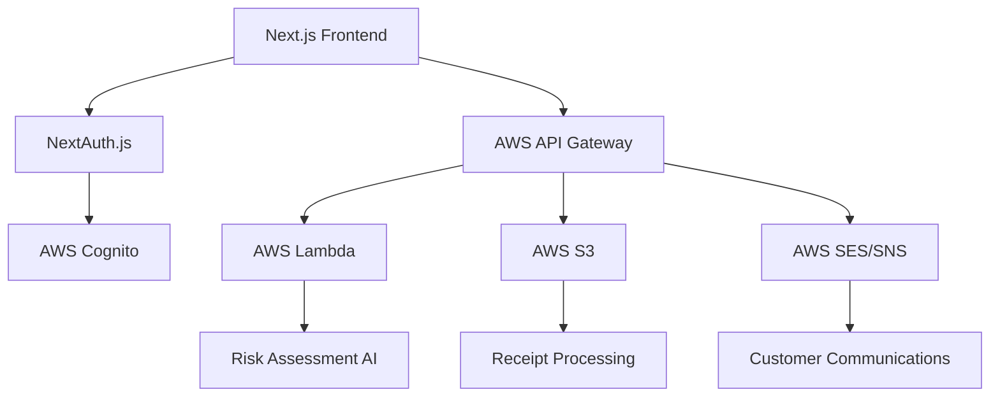

# Invoice Management System - Frontend

A modern, AI-powered invoice management system built with Next.js 14+ and integrated with AWS backend services for automated risk assessment, customer communications, and intelligent receipt processing.

## 🚀 Features

### 💼 Core Invoice Management
- **Invoice Creation & Tracking** - Create, edit, and track invoices with real-time status updates
- **Payment Processing** - Integrated payment workflows with multiple payment methods
- **Receipt Processing** - AI-powered receipt scanning and data extraction using AWS Textract
- **Invoice Templates** - Customizable invoice templates for different business needs

### 🤖 AI-Powered Risk Assessment
- **Automated Risk Scoring** - AI-driven risk assessment for each invoice using AWS Lambda
- **Risk Mitigation** - Intelligent recommendations for reducing payment risk
- **Predictive Analytics** - Historical data analysis for payment behavior patterns
- **Real-time Monitoring** - Continuous monitoring of invoice and customer risk factors

### 👥 Customer Management
- **Customer Profiles** - Comprehensive customer information with payment history
- **Communication Hub** - Centralized customer communication management
- **Automated Outreach** - AI-triggered email and SMS communications via AWS SES/SNS
- **Customer Segmentation** - Advanced filtering and categorization of customers

### 📊 Analytics & Reporting
- **Interactive Dashboards** - Real-time analytics with beautiful charts and visualizations
- **Payment Analytics** - Detailed insights into payment patterns and trends
- **Risk Reports** - Comprehensive risk assessment reports and forecasting
- **Custom Reports** - Generate custom reports based on specific business metrics

### 🔐 Security & Authentication
- **AWS Cognito Integration** - Secure authentication with multi-factor support
- **Role-Based Access** - Granular permissions and user role management
- **Data Encryption** - End-to-end encryption for sensitive financial data
- **Audit Logging** - Complete audit trail for all system activities

## 🛠️ Tech Stack

### Frontend
- **Framework**: Next.js 14+ with App Router
- **Language**: TypeScript with strict mode
- **UI Components**: shadcn/ui (Radix UI + Tailwind CSS)
- **Styling**: Tailwind CSS with custom design system
- **State Management**: Zustand
- **Forms**: React Hook Form with Zod validation
- **Charts**: Recharts for data visualization
- **Icons**: Lucide React

### Backend Integration
- **Authentication**: NextAuth.js with AWS Cognito
- **File Storage**: AWS S3 with presigned URLs
- **AI Processing**: AWS Lambda functions for risk assessment
- **Communication**: AWS SES for email, SNS for SMS
- **Data Processing**: AWS Textract for receipt OCR
- **Analytics**: AWS QuickSight integration

## 📋 Prerequisites

- Node.js 18+
- npm or yarn package manager
- AWS account with configured services
- Environment variables configured (see below)

## 🚀 Getting Started

### 1. Clone the Repository
```bash
git clone <repository-url>
cd frontend
```

### 2. Install Dependencies
```bash
npm install
# or
yarn install
```

### 3. Environment Setup
Create a `.env.local` file in the root directory:

```env
# Application
NEXT_PUBLIC_APP_URL=http://localhost:3000
NEXT_PUBLIC_API_URL=http://localhost:3000/api

# Authentication
NEXTAUTH_URL=http://localhost:3000
NEXTAUTH_SECRET=your-secret-key
AWS_COGNITO_CLIENT_ID=your-cognito-client-id
AWS_COGNITO_CLIENT_SECRET=your-cognito-client-secret
AWS_COGNITO_ISSUER=your-cognito-issuer

# AWS Services
AWS_REGION=us-east-1
AWS_ACCESS_KEY_ID=your-access-key
AWS_SECRET_ACCESS_KEY=your-secret-key
AWS_S3_BUCKET=your-s3-bucket
AWS_LAMBDA_FUNCTION_ARN=your-lambda-arn

# Feature Flags
NEXT_PUBLIC_ENABLE_AI_RISK=true
NEXT_PUBLIC_ENABLE_AUTO_COMMS=true
```

### 4. Start Development Server
```bash
npm run dev
# or
yarn dev
```

Visit `http://localhost:3000` to see the application running.

## 📁 Project Structure

```
├── app/                      # Next.js 14+ App Router
│   ├── (auth)/              # Authentication group
│   │   ├── login/
│   │   ├── signup/
│   │   └── forgot-password/
│   ├── dashboard/           # Protected dashboard routes
│   │   ├── invoices/
│   │   ├── customers/
│   │   ├── analytics/
│   │   └── settings/
│   └── api/                 # API routes
│       ├── auth/
│       ├── invoices/
│       └── aws/
├── components/
│   ├── ui/                  # shadcn/ui components
│   ├── dashboard/           # Dashboard-specific components
│   ├── forms/               # Form components
│   └── charts/              # Chart components
├── lib/
│   ├── api/                 # API client functions
│   ├── aws/                 # AWS SDK integrations
│   ├── auth/                # Authentication utilities
│   └── utils/               # Utility functions
├── store/                   # Zustand stores
├── types/                   # TypeScript definitions
└── changes/                 # Version documentation
```

## 🧪 Available Scripts

```bash
# Development
npm run dev          # Start development server
npm run build        # Build for production
npm run start        # Start production server

# Code Quality
npm run lint         # Run ESLint
npm run type-check   # TypeScript type checking

# Testing (if configured)
npm test             # Run test suite
npm run test:watch   # Run tests in watch mode
npm run test:coverage # Generate coverage report
```

## 🔧 Configuration

### AWS Services Setup
1. **AWS Cognito** - Set up user pool for authentication
2. **AWS Lambda** - Deploy risk assessment functions
3. **AWS S3** - Configure bucket for file storage
4. **AWS SES** - Set up email service for communications
5. **AWS Textract** - Enable OCR service for receipt processing

### Environment Variables
All required environment variables are documented in the `.env.example` file. Copy and configure according to your AWS setup.

## 🚢 Deployment

### Vercel (Recommended)
1. Connect your GitHub repository to Vercel
2. Configure environment variables in Vercel dashboard
3. Deploy automatically on push to main branch

### Alternative Platforms
- **AWS Amplify**: Native AWS integration
- **Netlify**: Simple deployment with form handling
- **Railway**: Container-based deployment

## 📊 Performance Optimization

- **React Server Components** for initial data fetching
- **Virtual scrolling** for large data tables
- **Lazy loading** for heavy components
- **Image optimization** with Next.js Image
- **Bundle analysis** with webpack-bundle-analyzer

## 🧪 Testing Strategy

- **Unit Tests**: Utility functions and hooks
- **Integration Tests**: API routes and AWS integrations
- **Component Tests**: Critical UI flows
- **E2E Tests**: Complete user journeys

## 📈 Version Control

This project uses a structured approach to version control and change management:

- Changes are documented in `/changes/version_[n].md`
- Each version file contains:
  - Timestamp and file modifications
  - Feature descriptions
  - Breaking changes
  - Rollback instructions

## 🤝 Contributing

1. Fork the repository
2. Create a feature branch (`git checkout -b feature/amazing-feature`)
3. Commit your changes (`git commit -m 'Add amazing feature'`)
4. Push to the branch (`git push origin feature/amazing-feature`)
5. Open a Pull Request

## 📝 License

This project is licensed under the MIT License - see the [LICENSE](LICENSE) file for details.

## 🆘 Support

For support and questions:
- Create an issue in this repository
- Check the documentation in `/changes/` for version-specific guidance
- Review the AWS integration guide in `FRONTEND_API_GUIDE.md`

## 🏗️ Architecture Overview



## 🔮 Roadmap

- [ ] Mobile app development
- [ ] Advanced analytics dashboard
- [ ] Multi-currency support
- [ ] API rate limiting
- [ ] Webhook integrations
- [ ] Advanced reporting features

---

Built with ❤️ using Next.js, TypeScript, and AWS services.